## 1. SELECT с использованием CASE/ SELECT 

### 1.1 Вывести информацию о посещениях (дата, рейтинг) и добавить вычисляемый столбец с текстовой расшифровкой оценки.

SELECT visit_date, rating,
    CASE 
        WHEN rating = 5 THEN 'Отлично'
        WHEN rating = 4 THEN 'Хорошо'
        WHEN rating = 3 THEN 'Нормально'
        ELSE 'Плохо'
    END AS rating_description
FROM Visits;

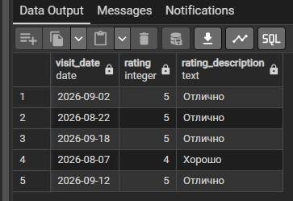

### 1.2 Вывести список всех залов и распределить их по категориям размера в зависимости от вместимости (capacity).

SELECT name AS gym_name, capacity,
    CASE 
        WHEN capacity < 15 THEN 'Маленький зал'
        WHEN capacity BETWEEN 15 AND 25 THEN 'Средний зал'
        ELSE 'Большой зал'
    END AS gym_size_category
FROM Gyms
ORDER BY capacity DESC;

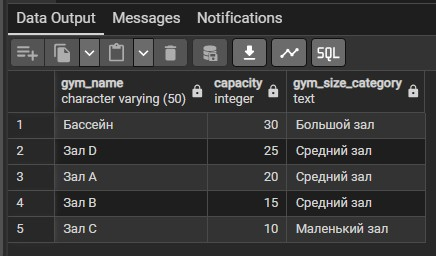

### 1.3 Вывести имена и фамилии клиентов, объединив их в один столбец с псевдонимом.

SELECT 
    first_name, 
    last_name, 
    email AS client_email
FROM Clients;

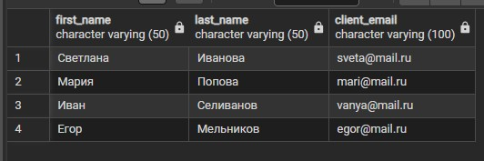

### 1.4 Вывести длительность тренировок в минутах и перевести её в часы (вычисляемый столбец).

SELECT 
    title, 
    duration_min,
    duration_min / 60.0 AS duration_hours
FROM WorkoutTypes;

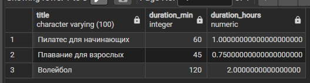

### 1.5 Вывести клиентов из Казани, которые родились до 2000 года.

SELECT 
    first_name, 
    last_name, 
    birth_date, 
    city
FROM Clients
WHERE city = 'Казань' AND birth_date < '2000-01-01';

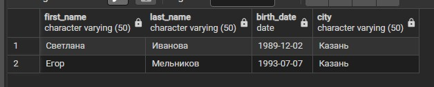

### 1.6 Вывести залы, вместимость которых находится в диапазоне от 15 до 25 человек включительно.

SELECT 
    name, 
    capacity
FROM Gyms
WHERE capacity BETWEEN 15 AND 25;

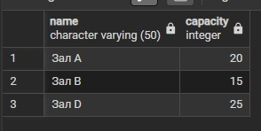

### 1.7 Вывести тренеров, чьи специализации имеют ID 1 или 3 (Плавание и Пилатес).

SELECT 
    first_name, 
    last_name, 
    spec_id
FROM Trainers
WHERE spec_id IN (1, 3);

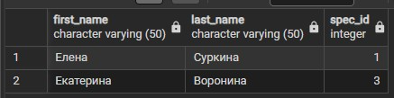

### 1.8 Вывести все посещения, отсортированные по дате (от новых к старым), а при совпадении дат — по рейтингу (от высшего к низшему).

SELECT 
    visit_date, 
    rating, 
    client_id
FROM Visits
ORDER BY visit_date DESC, rating DESC;

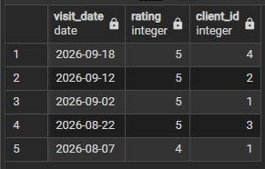

### 1.9 Вывести клиентов, чья фамилия начинается на букву «И» (например, Иванова).

SELECT 
    first_name, 
    last_name
FROM Clients
WHERE last_name LIKE 'И%';

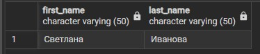

### 1.10 Вывести список всех уникальных городов, из которых к нам приходят клиенты.
 
SELECT DISTINCT 
    city
FROM Clients;

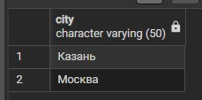

### 1.11 Вывести только первые 3 тренировки из расписания.

SELECT 
    workout_id, 
    start_time, 
    workout_type_id
FROM Workouts
LIMIT 3;

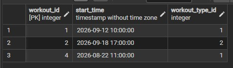

## 2. INNER JOIN (Внутреннее соединение)

### 2.1 Вывести дату посещения, рейтинг и полное имя клиента для всех состоявшихся посещений.

SELECT 
    v.visit_date,
    v.rating,
    c.first_name,
    c.last_name
FROM Visits v 
INNER JOIN Clients c ON v.client_id = c.client_id;

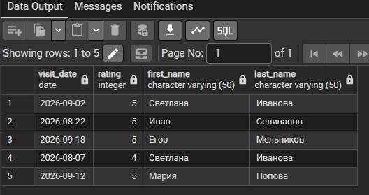

### 2.2 Вывести время начала тренировки, её название, имя тренера и название зала.

SELECT 
    w.start_time,
    wt.title,
    t.first_name || ' ' || t.last_name AS trainer_name,
    g.name AS gym_name
FROM Workouts w
INNER JOIN WorkoutTypes wt ON w.workout_type_id = wt.workout_type_id
INNER JOIN Trainers t ON wt.trainer_id = t.trainer_id
INNER JOIN Gyms g ON wt.hall_id = g.hall_id;

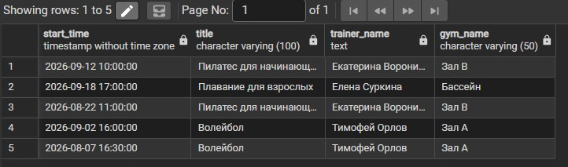

## 3. LEFT JOIN (Левое внешнее соединение)

### 3.1 Вывести всех клиентов и их посещения. Если клиент еще ни разу не был на тренировке, в полях посещения будет NULL.

SELECT 
    c.first_name,
    c.last_name,
    v.visit_date,
    v.rating
FROM Clients c
LEFT JOIN Visits v ON c.client_id = v.client_id;

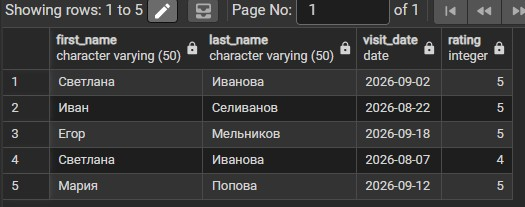

### 3.2 Вывести все существующие типы тренировок и время их проведения. Если для какого-то типа еще не составлено расписание, время будет NULL.

SELECT 
    wt.title,
    w.start_time
FROM WorkoutTypes wt
LEFT JOIN Workouts w ON wt.workout_type_id = w.workout_type_id;

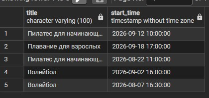

## 4. RIGHT JOIN (Правое внешнее соединение)

### 4.1 Вывести все факты проведения тренировок и их типы. Если тип тренировки не найден, название будет NULL.

SELECT 
    w.start_time,
    wt.title
FROM Workouts w
RIGHT JOIN WorkoutTypes wt ON w.workout_type_id = wt.workout_type_id;

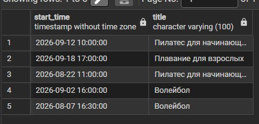

### 4.2 Вывести все посещения и данные клиентов. Если клиент еще ни разу не был на тренировке, в полях посещения будет NULL.

SELECT 
    v.visit_date,
    c.first_name,
    c.last_name
FROM Visits v
RIGHT JOIN Clients c ON v.client_id = c.client_id;

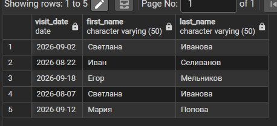

## 5. CROSS JOIN (Перекрестное соединение / Декартово произведение)

### 5.1 Создать список всех клиентов в сочетании со всеми залами.

SELECT 
    c.first_name,
    c.last_name,
    g.name AS gym_name
FROM Clients c
CROSS JOIN Gyms g
ORDER BY c.client_id, g.hall_id;

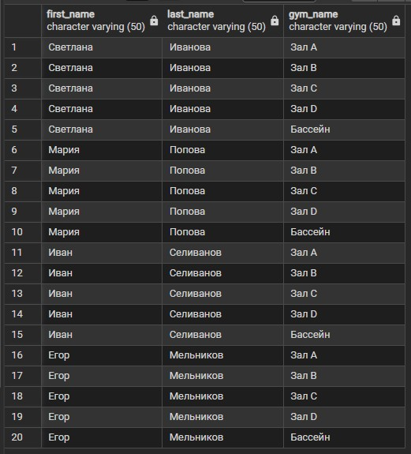

### 5.2 Вывести всех клиентов и все доступные типы тренировок.

SELECT 
    c.first_name,
    wt.title
FROM Clients c
CROSS JOIN WorkoutTypes wt;

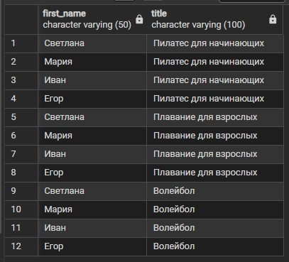

## 6. OUTER JOIN (Полное внешнее соединение / FULL OUTER JOIN)

### 6.1 Вывести всех клиентов (даже тех, кто не ходил) и все посещения (даже те, где клиент не указан, если бы такое было возможно).

SELECT 
    c.first_name,
    c.last_name,
    v.visit_date
FROM Clients c
FULL OUTER JOIN Visits v ON c.client_id = v.client_id;

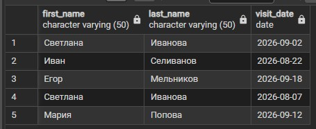

### 6.2 Вывести все типы тренировок и все расписания. Покажет и типы без расписания, и расписания без привязанного типа (если бы нарушилась целостность).

SELECT 
    wt.title,
    w.start_time
FROM WorkoutTypes wt
FULL OUTER JOIN Workouts w ON wt.workout_type_id = w.workout_type_id;

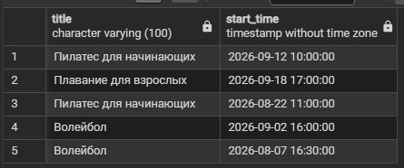